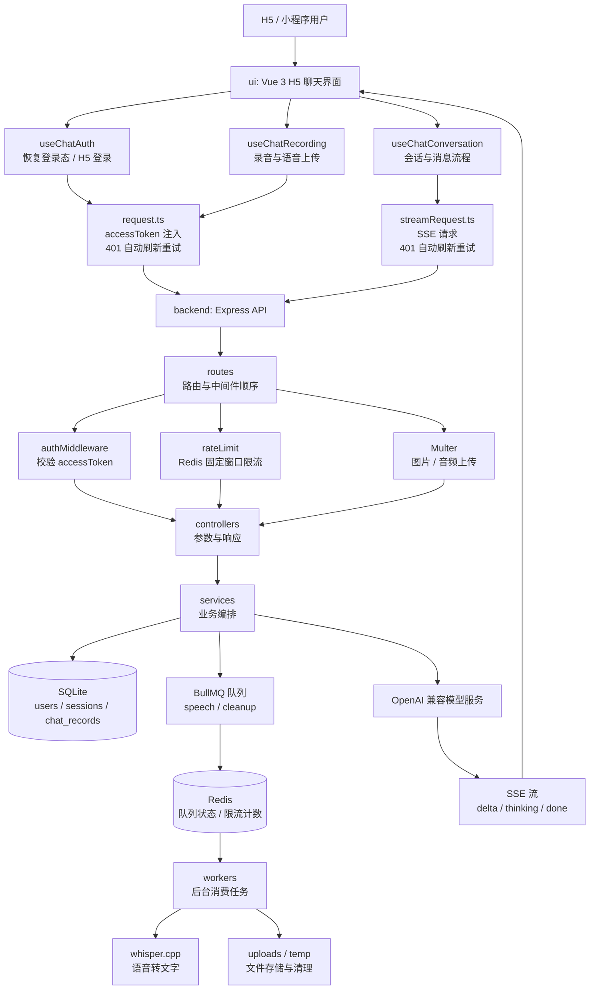
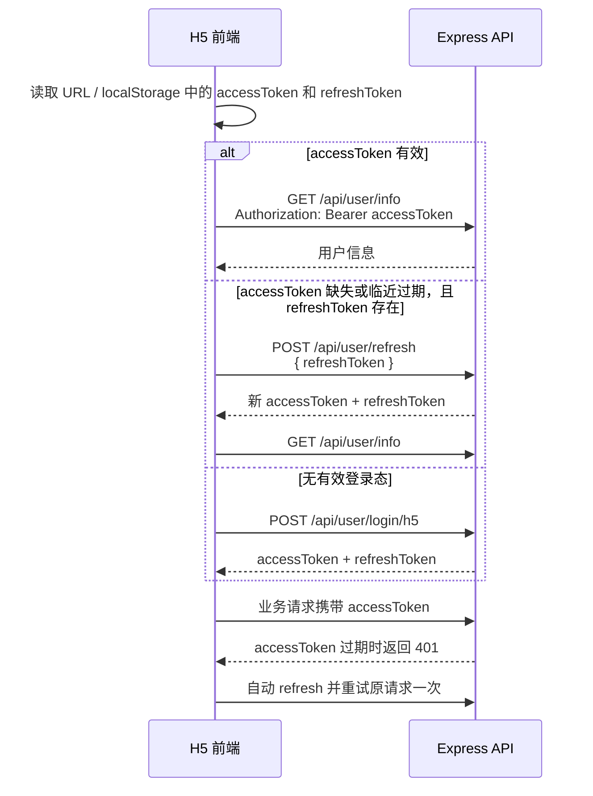

# AI 智能助手

本项目是一个 H5 / 小程序通用的 AI 对话系统，采用前后端同仓库维护：

- 前端：`ui/`，Vue 3 + TypeScript + Vite 的 H5 聊天界面。
- 后端：`backend/`，Express + SQLite 的 API 服务。
- 后台能力：Redis 限流、BullMQ 异步任务、whisper.cpp 本地语音转文字。
- 接口文档：后端运行后访问 `/docs` 或 `/docs.json`。

## 核心能力

- H5 自动登录，支持 `accessToken + refreshToken` 双 token 无感刷新。
- SSE 流式 AI 对话，支持 `delta`、`thinking`、`done` 事件。
- 会话列表、历史消息、删除会话、消息点赞、助手消息重新生成。
- 图片上传与持久化展示。
- 语音录制、前端标准化 WAV、后端异步转文字。
- Redis 固定窗口限流，保护登录、AI 和语音接口。
- BullMQ 后台队列，处理语音识别和临时文件清理任务。

## 技术栈

| 层 | 技术 |
| --- | --- |
| 前端 | Vue 3、TypeScript、Vite、Element Plus、Sass、markdown-it、recordrtc |
| 后端 | Node.js ESM、Express 5、SQLite3、JWT、Multer、OpenAI SDK |
| 中间件 | Redis、BullMQ |
| 语音 | Browser MediaRecorder / Web Audio API、whisper.cpp |
| 文档 | Swagger UI |

## 项目结构

```text
.
├── ui/                         # H5 前端
│   ├── src/App.vue             # 页面入口
│   ├── src/components/         # 聊天 UI 组件
│   ├── src/hook/               # 鉴权、会话、流式响应、录音、滚动逻辑
│   ├── src/utils/api.ts        # API 路径与后端基地址
│   ├── src/utils/request.ts    # 普通请求、token 注入、401 刷新重试
│   └── src/utils/streamRequest.ts # SSE 请求与流式 401 刷新重试
├── backend/                    # Express API 服务
│   ├── clients/                # OpenAI / DeepSeek 客户端
│   ├── controllers/            # HTTP 入参与响应
│   ├── docs/swagger/           # Swagger 注释定义
│   ├── middleware/             # 鉴权、限流、上传、whisper 封装
│   ├── queues/                 # Redis / BullMQ 队列定义
│   ├── repositories/           # SQLite 数据访问
│   ├── routes/                 # 路由挂载
│   ├── services/               # 业务编排
│   ├── workers/                # BullMQ worker 入口
│   ├── db.js                   # SQLite 初始化
│   └── index.js                # 服务入口
├── AGENTS.md                   # 协作与运行约定
└── package.json                # monorepo 脚本
```

## 当前架构流程图



## 分层约定

后端请求链路：

```text
routes
  -> middleware(auth / rateLimit / upload)
  -> controllers
  -> services
  -> repositories / clients / queues
```

- `routes`：只描述接口路径和中间件顺序，不写业务规则。
- `middleware`：处理鉴权、限流、上传等横切能力。
- `controllers`：做 HTTP 入参转换和响应格式。
- `services`：承载业务编排，例如登录签发 token、创建会话、写消息、创建语音任务。
- `repositories`：只封装 SQLite 读写。
- `queues`：只封装 Redis / BullMQ 队列定义与任务投递。
- `workers`：后台消费队列，执行耗时任务。

## 运行要求

- Node.js `>= 20.18.0`
- npm `>= 10`
- 可用的 OpenAI 兼容模型服务
- Redis 服务，用于限流和 BullMQ 队列
- 如启用语音转写，需要本地可执行的 `whisper.cpp`

## 快速开始

根目录安装依赖：

```bash
npm install
```

启动前后端：

```bash
npm run dev:all
```

单独启动：

```bash
npm run dev:frontend
npm run dev:backend
```

启动后台 worker：

```bash
npm --prefix backend run worker:all
```

构建前端：

```bash
npm run build:frontend
```

生产启动后端：

```bash
npm run start:backend
```

默认地址：

- 前端开发服务：`http://localhost:5173`
- 后端 API：`http://localhost:3000`
- Swagger：`http://localhost:3000/docs`

## 环境变量

后端 `backend/.env`：

| 变量名 | 必填 | 说明 |
| --- | --- | --- |
| `JWT_SECRET` | 是 | JWT 签名密钥 |
| `DB_FILE` | 是 | SQLite 文件路径，支持相对路径或绝对路径 |
| `OPENAI_API_KEY` | 是 | 模型服务 API Key |
| `OPENAI_BASE_URL` | 是 | OpenAI 兼容服务地址 |
| `PORT` | 否 | 默认 `3000` |
| `HOST` | 否 | 开发环境默认 `0.0.0.0`，生产环境默认 `127.0.0.1` |
| `CORS_ORIGIN` | 否 | 开发环境允许的跨域来源，多个用逗号分隔 |
| `WX_APP_ID` | 否 | 小程序登录所需 |
| `WX_APP_SECRET` | 否 | 小程序登录所需 |
| `REDIS_URL` | 否 | 默认 `redis://127.0.0.1:6379` |
| `WHISPER_ROOT` | 否 | 默认 `./whisper.cpp` |
| `WHISPER_SAMPLE_PATH` | 否 | 默认 `./sample-6s.wav` |
| `LOGIN_RATE_LIMIT_WINDOW_MS` | 否 | 登录限流窗口，默认 `600000` |
| `LOGIN_RATE_LIMIT_MAX` | 否 | 登录限流窗口内最大请求数，默认 `20` |
| `AI_RATE_LIMIT_WINDOW_MS` | 否 | AI 接口限流窗口，默认 `60000` |
| `AI_RATE_LIMIT_MAX` | 否 | AI 接口限流窗口内最大请求数，默认 `60` |
| `SPEECH_RATE_LIMIT_WINDOW_MS` | 否 | 语音接口限流窗口，默认 `3600000` |
| `SPEECH_RATE_LIMIT_MAX` | 否 | 语音接口限流窗口内最大请求数，默认 `30` |
| `CLEANUP_UPLOADS_EVERY_MS` | 否 | 清理任务执行间隔，默认 `3600000` |
| `UPLOAD_FILE_MAX_AGE_MS` | 否 | 上传/临时文件最大保留时长，默认 `86400000` |

前端 `ui/.env.local` 或 `ui/.env.development`：

```bash
VITE_OPENAI_BASE_URL=http://localhost:3000
```

说明：变量名沿用历史命名，实际含义是后端 API 服务地址。

## 登录与鉴权

当前采用双 token：

- `accessToken`：短期访问令牌，默认 15 分钟，只用于业务接口。
- `refreshToken`：长期刷新令牌，默认 7 天，只用于 `/api/user/refresh`。
- `token`：后端响应中保留的兼容字段，值等于 `accessToken`。



H5 默认调试登录账号在 `ui/src/hook/useChatAuth.ts` 中维护：

```json
{
  "username": "h5_test",
  "password": "pass123"
}
```

生产环境应替换为正式登录入口。

## API 总览

### 用户接口

| 方法 | 路径 | 鉴权 | 说明 |
| --- | --- | --- | --- |
| `POST` | `/api/user/login` | 否 | 小程序登录 |
| `POST` | `/api/user/login/h5` | 否 | H5 账号密码登录，不存在则自动注册 |
| `GET` | `/api/user/info` | accessToken | 获取当前用户信息 |
| `POST` | `/api/user/refresh` | refreshToken | 刷新 accessToken 与 refreshToken |

### AI 与会话接口

| 方法 | 路径 | 鉴权 | 说明 |
| --- | --- | --- | --- |
| `POST` | `/api/ai/chat` | accessToken | 正式聊天接口，支持 JSON 和图片上传 |
| `GET` | `/api/ai/sessions` | accessToken | 获取当前用户会话列表 |
| `GET` | `/api/ai/sessions/:id/messages` | accessToken | 获取会话消息 |
| `POST` | `/api/ai/sessions/:id/delete` | accessToken | 删除会话及其消息 |
| `GET` | `/api/ai/models` | accessToken | 获取模型列表 |
| `POST` | `/api/ai/messages/:id/like` | accessToken | 切换消息点赞状态 |
| `POST` | `/api/ai/messages/:id/regenerate` | accessToken | 重新生成指定助手消息 |
| `POST` | `/api/ai/speech-to-text/jobs` | accessToken | 创建异步音频转文字任务 |
| `GET` | `/api/ai/speech-to-text/jobs/:id` | accessToken | 查询异步音频转文字任务 |

## 主要业务流程

### 对话

1. 前端发送文本或图片消息到 `/api/ai/chat`。
2. 后端鉴权、限流并处理上传文件。
3. 未传 `sessionId` 时创建新会话。
4. 用户消息写入 `chat_records`。
5. 后端调用 OpenAI 兼容模型服务。
6. 流式模式下通过 SSE 返回 `delta`、`thinking`、`done`。
7. 结束后将助手完整回复写回数据库。

文本请求示例：

```json
{
  "messages": [
    {
      "role": "user",
      "type": "text",
      "content": "你好"
    }
  ],
  "sessionId": 1,
  "stream": true,
  "model": "deepseek-v4-flash"
}
```

图片请求使用 `multipart/form-data`：

- `messages`：JSON 字符串
- `image`：图片文件
- `sessionId`：可选
- `stream`：`true`
- `model`：模型名

### 语音转文字

```text
前端录音
  -> 标准化为 WAV(PCM / 16bit / 单声道 / 16kHz)
  -> POST /api/ai/speech-to-text/jobs
  -> authMiddleware 校验用户
  -> speechRateLimit 使用 Redis 限流
  -> upload.single('audio') 保存音频
  -> BullMQ speech-transcription 队列记录任务
  -> speechWorker 调用 whisper.cpp 转写
  -> GET /api/ai/speech-to-text/jobs/:id 查询结果
```

前端录音策略：

- 优先使用 `MediaRecorder`。
- 不支持或初始化失败时回退到 Web Audio API。
- 无论浏览器输出 webm、ogg 还是 wav，最终都会标准化成 16kHz WAV。
- 标准化放在前端完成，减少后端对 ffmpeg 等转码工具的依赖。

### 限流

当前限流使用 Redis 固定时间窗口：

```text
rate:{业务前缀}:{用户或IP}:{窗口编号}
```

每次请求通过 Redis `INCR` 原子递增计数，第一次写入时设置过期时间。超过阈值返回 `429`。Redis 短暂不可用时限流降级放行，避免限流组件故障导致核心接口整体不可用。

### BullMQ 队列

- `speech-transcription`：处理语音识别，避免请求线程阻塞。
- `cleanup-uploads`：定时清理上传文件和临时文件。
- Redis 负责保存队列任务状态、重试信息和限流计数。

## 数据存储

SQLite 主要表：

| 表 | 说明 |
| --- | --- |
| `users` | 用户账号、昵称、头像、默认模型、最后登录时间 |
| `sessions` | 会话标题、所属用户、创建与更新时间 |
| `chat_records` | 消息内容、角色、类型、媒体路径、推理内容、点赞状态 |

## whisper.cpp 准备

如果需要启用语音识别，在 `backend` 目录执行：

```bash
git clone https://github.com/ggerganov/whisper.cpp.git
cd whisper.cpp
bash ./models/download-ggml-model.sh tiny
mkdir build
cd build
cmake ..
make -j4
```

默认要求：

- 可执行文件：`backend/whisper.cpp/build/bin/whisper-cli`
- 模型文件：`backend/whisper.cpp/models/ggml-tiny.bin`

如放在其他目录，需要显式配置 `WHISPER_ROOT`。

## 部署要点

- 前端生产构建产物在 `ui/dist`。
- 建议前端和后端挂在同一域名下，通过 Nginx 反向代理 `/api` 和 `/uploads`。
- SSE 需要关闭代理缓冲，并放宽读写超时。
- 生产环境默认不启用 CORS，跨域部署时需要明确配置网关或 `CORS_ORIGIN`。
- SQLite 适合单机部署；并发和数据量增长后应评估迁移到 MySQL / PostgreSQL。

Nginx 关键配置示例：

```nginx
location / {
    try_files $uri $uri/ /index.html;
}

location /api/ {
    proxy_pass http://127.0.0.1:3000;
    proxy_http_version 1.1;
    proxy_set_header Host $host;
    proxy_set_header X-Real-IP $remote_addr;
    proxy_set_header X-Forwarded-For $proxy_add_x_forwarded_for;
    proxy_set_header X-Forwarded-Proto $scheme;

    proxy_read_timeout 3600s;
    proxy_send_timeout 3600s;
    proxy_buffering off;
    add_header X-Accel-Buffering no;
}

location /uploads/ {
    proxy_pass http://127.0.0.1:3000;
    proxy_set_header Host $host;
}
```

## 已知限制

- 当前没有自动化测试和 CI。
- 数据库 schema 通过启动时建表与 `ALTER TABLE` 维护，没有独立迁移工具。
- `/api/ai/models` 依赖上游模型服务的 `models.list()` 能力。
- H5 默认登录账号仅适合本地调试，不适合直接作为正式生产登录方案。
- 语音识别依赖 Redis、BullMQ worker 与本地 `whisper.cpp` 环境。
